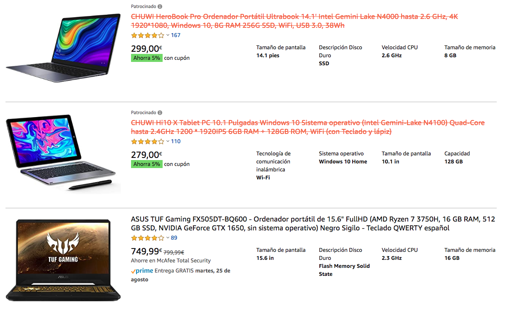

# Send here please!

This is a _Chrome Extension_ to identify non-eligible products on **Amazon** because they are not sent to some locations. In this case, we live at [Canary Islands](https://en.wikipedia.org/wiki/Canary_Islands) and unfortunately there are a lot of Amazon products that they do not send here. Furthermore there is no choice to filter those products which are eligible.

> This extension provides a way to highlight and cross out the non-eligible products for sending reasons.

This project is a fork from the original _SendHerePlz_ project developed by Micael Martín ([@micaelcometa](https://github.com/micaelcometa)) at [Desarrollo Cometa](https://desarrollocometa.com):

## Installation

- [Download](https://github.com/sdelquin/sendhereplz/archive/master.zip) the project.
- Uncompress the `.zip` file (a folder named `sendhereplz-master` is created).
- Place the folder where you want to keep it (write down this location).
- Open [Chrome](https://www.google.com/intl/es_es/chrome/) browser.
- Go to `chrome://extensions/` on navigation bar.
- Click on <kbd>Load unpacked</kbd>. (_"Cargar descomprimida"_ in spanish)
- Select the folder from the location where the extension was saved.

## Usage

Now you can browse in Amazon, search for your dreamy products and check quickly those which are not being sent to your location.

## Disclaimer

Currently the extension only works for:

- [amazon.es](https://amazon.es) 
- [amazon.com](https://amazon.com) 
- [amazon.it](https://amazon.it) 

It can be extended for other languages/countries.
