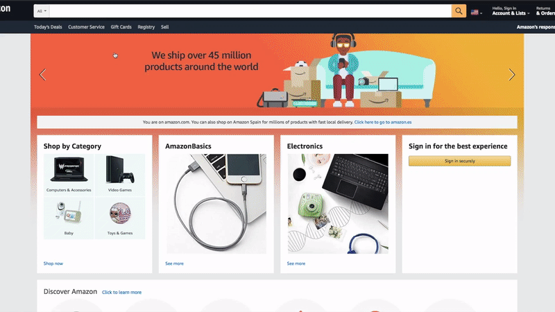

# SendHerePlz - Amazon shipment availability checker

This is a **Chrome Extension** with one clear aim: **"Highlight non-eligible Amazon items because of shipment reasons"**.

Have you ever spend hours looking for items on Amazon sites but none of them were available for shipment to your location? With this extension you will be able to detect these items from the results page, so you can easily identify which products are eligible for you.

## Features

- Highlight and cross out the non-eligible items (within the results page) because of shipment reasons.
- Add a badge for each item (within the results page) which is only available through other sellers.
- It works with any Amazon site regardless of the language you use.

## Installation

### User mode

Just add it to your Chrome browser from [our page on the Chrome Web Store](https://chrome.google.com/webstore/detail/sendhereplz/anpeeogkdbgkhakjldceemkolhggobhd).

### Developer mode

- [Download](https://github.com/sdelquin/sendhereplz/archive/master.zip) the project.
- Uncompress the `.zip` file (a folder named `sendhereplz-master` is created).
- Place the folder where you want to keep it (write down this location).
- Open [Chrome](https://www.google.com/intl/es_es/chrome/) browser.
- Go to `chrome://extensions/` on navigation bar.
- Check the box for **Developer Mode** in the top right. (_"Modo desarrollador"_ in spanish)
- Click on **Load unpacked**. (_"Cargar descomprimida"_ in spanish)
- Select the folder from the location where the extension was saved.

#### Feedback

If you want to give us any feedback you are very welcome [to add a new issue](https://github.com/sdelquin/sendhereplz/issues).

## Usage

You can check the behaviour of the extension with this video:

Note that:

- First item is crossed out because Amazon does not ship it to your location.
- Second item is kept as usual because it is fully eligible (in terms of shipment).
- Third item has a new badge below to indicate that it is only available for other sellers.

## Former

This project is a fork from the original _SendHerePlz_ project developed by Micael Martín ([@micaelcometa](https://github.com/micaelcometa)) at [Desarrollo Cometa](https://desarrollocometa.com):

